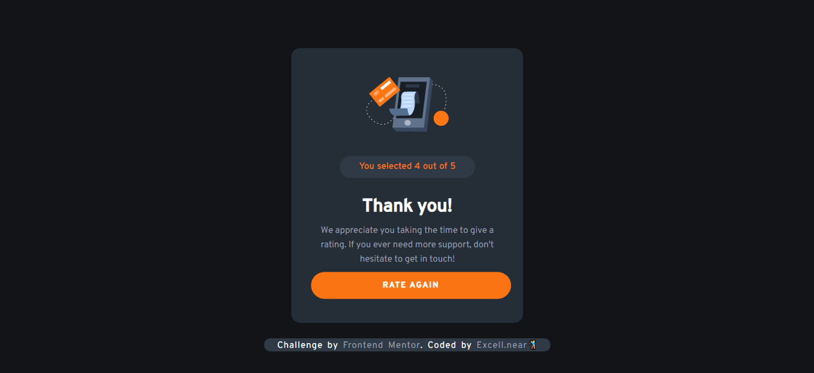

# ⭐FrontendMentor - Interactive Rating Component(ReactJS)

Thanks for checking out this front-end coding challenge.

Frontend Mentor challenges help you improve your coding skills by building realistic projects and today I worked on a rating app.

[Homepage](./src/images/challenge1.png)
[Active page](./src/images/challenge2.png)
[Result page](./src/images/challenge3.png)

## Description

This challenge was to build a numbered interactive rating component and get it looking as close to the design as possible.

You can use any tools you like to help you complete the challenge...

But I used;

- React
- Vanilla CSS

## Features

Your users should be able to:

- View the optimal layout for the app depending on their device's screen size
- See hover states for all interactive elements on the page
- Select and submit a number rating
- See the "Thank you" card state after submitting a rating

## Lessons

Tis is my first take on building a react application having been going throuhg the docs for couple weeks now. I learned a lot about;

- React useState hook
- Parsing props
- Working with event listeners

## Live demo

Here's a link to view the [LIVE PAGE](https://interactive-react-rating-app.netlify.app/)

### Getting Started with Create React App

This project was bootstrapped with [Create React App](https://github.com/facebook/create-react-app).

## Available Scripts

In the project directory, you can run:

#### `npm start`

Runs the app in the development mode.\
Open [http://localhost:3000](http://localhost:3000) to view it in your browser.

The page will reload when you make changes.\
You may also see any lint errors in the console.

#### `npm test`

Launches the test runner in the interactive watch mode.\
See the section about [running tests](https://facebook.github.io/create-react-app/docs/running-tests) for more information.

#### Learn More

You can learn more in the [Create React App documentation](https://facebook.github.io/create-react-app/docs/getting-started).
